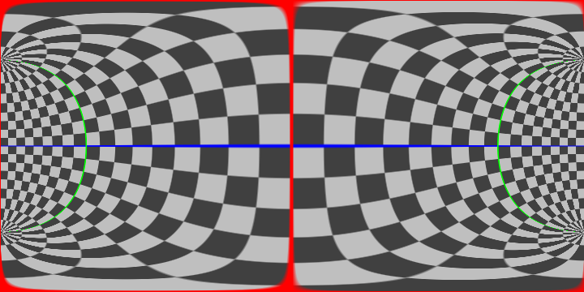
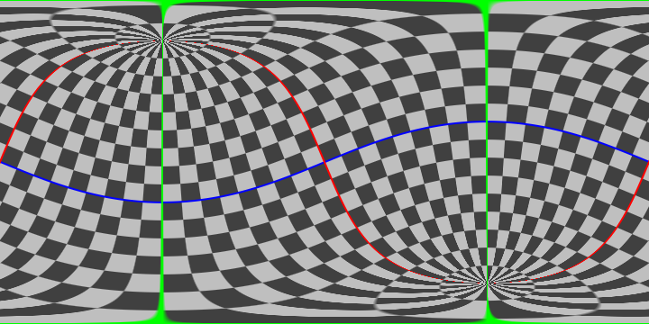

# Mobius

## Overview

Möbius transformations make it possible to apply zoom, rotate, and translate effects to immersive 360VR footage. With Möbius operations, the input and output media retains the original 360&deg;x180&deg; degree spherical image projection.

This is distinctly different from the results you get with traditional "overcapture" 360VR reframing processes that translates a source 360&deg;x180&deg; degree spherical image projection into either a traditional rectilinear "flat" image projection output, or a stereographic "tiny planet" image projection.

## Acknowledgements

This project is a fork of Henry Segerman's [Spherical Image Editing GitHub repository](https://github.com/henryseg/spherical_image_editing).

My goal is to port the underlying math formulas from Henry's original code to run as a hardware-accelerated fragment shader inside of DCC packages like Blackmagic Design's Resolve/Fusion post-production software.

## License

The Möbius transform source code is covered by an Apache 2.0 open-source license.

## Python Installation

The following resources are required to use the Python based source code in this repository:

    Python x64 v3.6 - v3.10

3rd Party Python Library Install:

    pip3 install --upgrade pip
    pip3 install Pillow
    pip3 install numpy
    pip3 install scipy

## Screenshots

Mobius Spherical Zooming:

Mobius Spherical Rotations:

## Python CLI Usage Instructions

    python3 mobius.py --input "source.0000.png" --output "output.0000.png" --x 180 --y 270 --zoom 10

## Python Script Syntax

    usage: mobius.py [-h] -i INPUT -o OUTPUT -x X -y Y -z ZOOM

    Apply Mobius transformations to spherical 360x180 degree footage.

    options:
      -h, --help            show this help message and exit
      -i INPUT, --input INPUT
                            The filepath to your source image
      -o OUTPUT, --output OUTPUT
                            The filepath to your output image
      -x X, --x X           Center X (in degrees)
      -y Y, --y Y           Center Y (in degrees)
      -z ZOOM, --zoom ZOOM  Zoom level

Last Edited: (2022-09-01)
